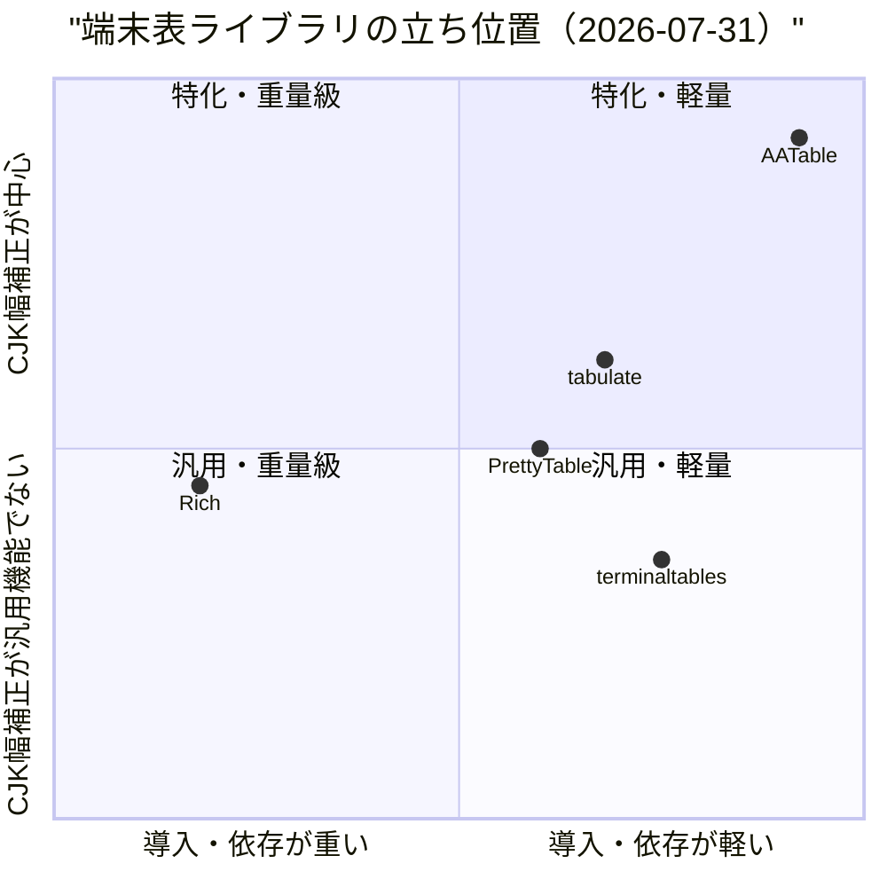
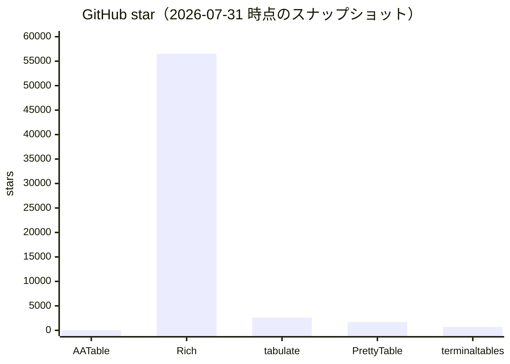
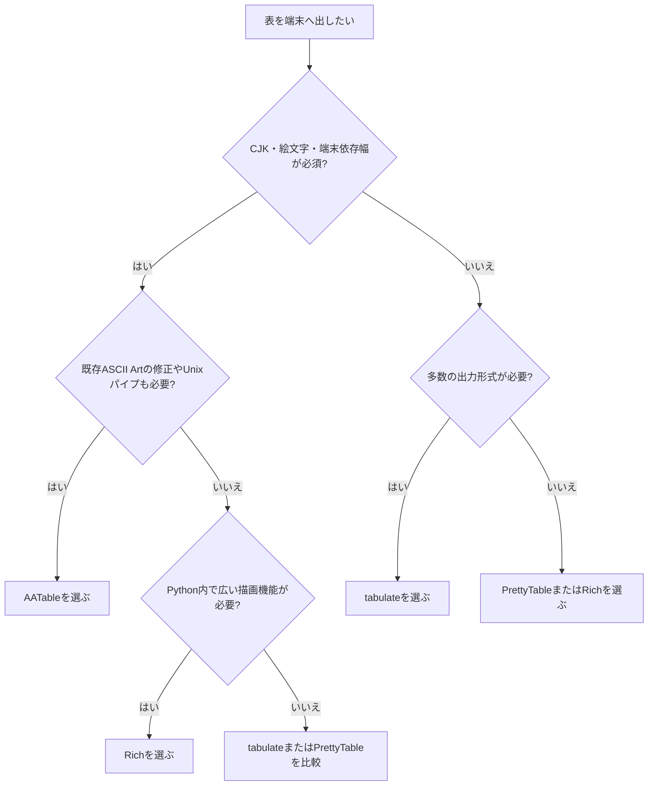

# 0. 要約

立ち位置: AATable は、一般的な表出力市場では小さいが、CJK・絵文字・端末依存幅を壊さずに Unix パイプへ流す用途で差別化できる軽量ライブラリ/CLI である。

最大の弱点: 2026-07-31 時点で PyPI 配布、インストール後のコマンド、公開 API の一本化がなく、採用時の入口が `git clone` と個別スクリプトに留まる。

次の一手: 幅計算を単一の公開 API として固定し、PyPI/CLI 導線と「CJK が揃う」回帰テストを整えて、既存の表ライブラリから置き換える理由を明確にする。

# 1. このrepoは何か

AATable は、Markdown / CSV / TSV を罫線付き ASCII Art テーブルへ変換する `aatable.py` を中心に、Mermaid→Graph::Easy 変換、既存 ASCII Art の CJK 幅修正、端末の Ambiguous 幅測定を行う4本の Python スクリプトである。各スクリプトは stdin/file→stdout の Unix フィルタとして組み合わせられる。[README](https://github.com/opaopa6969/AATable/blob/6f2da042090017ff9d11247dba3674212919bd15/README.md) と [architecture.md](https://github.com/opaopa6969/AATable/blob/6f2da042090017ff9d11247dba3674212919bd15/docs/architecture.md) を読み、実装も確認した。

提供価値は、Python の `len()` や単純なコードポイント数ではなく、East Asian Width と手書きの grapheme cluster 分割を使って端末上の列幅を計算し、CJK・絵文字・ZWJ・国旗・Ambiguous 文字を含む出力の崩れを減らすことにある。利用者は、`psql`、`docker ps`、`git log`、`curl|jq` などの出力を端末で読む開発者である。AATable 単体ではなく、これらの前段コマンドと端末表示の間に置く「表整形・幅補正のパイプライン」として価値を出す。

到達点として、HEAD は `6f2da04`、Python ソース5本・合計1,413行、テスト5ファイル・218行、`pytest` は **37 passed / 0.02秒**だった。`pyproject.toml` の実行時依存は0、ライセンスは MIT である。GitHub は調査時点で **0 stars、リリースなし、15 commits**だった。[GitHub](https://github.com/opaopa6969/AATable) とローカル実行結果を根拠にした。

この比較で置き換える対象は「Python 内で表を描くクラス」だけではない。AATable の実際の仕事である、入力を受け取り、幅を判断し、端末向け文字列を出す CLI/ライブラリ全体と比較する。

# 1.5 調査の型

`target_type: library` とした。配布物は CLI スクリプト群だが、`display_width()`、`pad_to_width()`、各 parser、`render_aa_table()` という再利用可能な Python 関数を持ち、選択を左右するのは機能だけでなく API 面、依存の重さ、テスト、配布形態だからである。したがって、コードを読める OSS ライブラリを比較し、サンプル出力の「美しさ」は評価しない。

# 2. 比較対象と選定理由

| 製品 | 何ができるか | 採用状況（2026-07-31参照） | ライセンス | うちとの決定的な違い | なぜ比較対象に選んだか |
|---|---|---:|---|---|---|
| [Rich](https://github.com/Textualize/rich) | 色、スタイル、表、折返し、Markdown、進捗などを端末へ描画。表は端末幅に合わせてリサイズ/折返し | ★56.5k / GitHub上の最新リリース 2026-04-12 | MIT | 表は Rich のレンダリング基盤の一部で、依存と機能範囲が大きい。AATable は plain stdout と幅補正に集中 | Python で端末出力を作る場合の最大級の代替。機能を増やす判断の上限を示す |
| [tabulate](https://github.com/astanin/python-tabulate) | 1関数と CLI で、list/dict/DataFrame 等を多数の plain text/Markdown/HTML/LaTeX 形式へ変換 | ★2.6k / PyPI 0.10.0 2026-03-04 | MIT | 入力型・出力形式・数値整列が広い。CJK 幅は optional `wcwidth` 依存 | AATable の「表形式→テキスト」の最も直接的な置換候補 |
| [PrettyTable](https://github.com/prettytable/prettytable) | Python API で ASCII 表を構築し、多数の罫線・整列・出力形式を提供 | ★1.7k / PyPI 3.18.0 2026-06-22 | BSD-3-Clause | オブジェクト中心の API と表編集機能が厚い。AATable は入力をそのままパイプで処理 | 端末向け見た目と Python API を重視する定番候補 |
| [terminaltables](https://github.com/Robpol86/terminaltables) | 複数の terminal table class で ASCII/Unicode 表を出力 | ★687 / 最新リリース 2016-10-17、2021-12-07 archive | MIT | 同じ terminal table 層だが保守終了。AATable の CJK 幅補正という問題設定に近い | 既存の軽量 terminal-table 採用例と、保守性の下限を確認するため |

Rich は市場の上位にいるが、表だけを必要とする利用者には過剰になりうる。tabulate と PrettyTable は機能の標準的な横幅を押さえており、AATable はそこに対して「入力形式の広さ」ではなく「表示幅の正しさ」と「依存なし」を売る位置にある。terminaltables は機能的な競合というより、保守終了した軽量実装を採用し続けるリスクの比較対象である。

## 3. ポジショニング

横軸は実行時依存と導入手順、縦軸は表機能全般ではなく本調査の勝負所である幅補正の中心性を表す。Rich/PrettyTable の位置は機能範囲と依存の実装を読んだ上での相対評価（推測）で、star 数から品質を推定したものではない。

# 4. 機能比較

| 機能 | 重み | AATable | Rich | tabulate | PrettyTable | terminaltables |
|---|---|---|---|---|---|---|
| CJK/East Asian Width を意識した列整列 | ◎必須 | ○ | △ | △（`wcwidth` optional） | △ | △ |
| 絵文字・ZWJ・国旗の幅処理 | ◎必須 | ○ | ○ | △ | △ | × |
| Ambiguous 幅の指定/端末キャリブレーション | ◎必須 | ○ | △ | △ | × | × |
| Markdown / CSV / TSV を stdin から処理 | ◎必須 | ○ | △（Rich CLI は CSV/TSV 表示） | ○ | △ | × |
| Python API から直接レンダリング | ○効く | ○ | ○ | ○ | ○ | ○ |
| 依存なしで即実行 | ○効く | ○ | × | △ | × | × |
| 複数の罫線スタイル/整列 | ○効く | ○ / 5 styles | ○ | ○ / 多数の format | ○ | ○ |
| 端末幅に合わせた折返し・縮小 | △あれば | × | ○ | △ | △ | × |
| 既存 ASCII Art の後処理 | ○効く | ○ | × | × | × | × |
| Mermaid→Graph::Easy パイプ | △あれば | ○ | × | × | × | × |

AATable の痛い欠けは、端末幅に応じた折返し・縮小と、一般的な Python パッケージとしての導入である。大きな表を狭い端末で読む仕事なら Rich の方が安全で、アプリケーションに組み込むなら tabulate/PrettyTable の入力型対応が効く。一方、CJK 幅、Ambiguous 幅、既存出力の修正を同時に要求する行は、競合の単純な○では代替しにくい。

逆に、罫線の種類や Python API は差別化になりにくい。tabulate・PrettyTable・Rich がすでに提供しているため、そこだけを増やしても採用理由は薄い。AATable の表形式 parser と後処理は、一般的な表ライブラリではなく「壊れた端末出力を救う」周辺機能として読まれるべきである。

## 4.5 コード・実装の比較

| 観点 | AATable | tabulate | PrettyTable | Rich / terminaltables | 出典・確認方法 |
|---|---:|---:|---:|---:|---|
| 公開 API/主要入口 | 27 public functions（5 `.py` を AST 集計） | `__all__` 3項目（`tabulate`, `tabulate_formats`, `simple_separated_format`） | `PrettyTable` 等のクラス API | Rich は `Console`/`Table` 等、terminaltables は複数 table class（総数は今回未集計） | AATable は HEAD の AST、[tabulate source](https://raw.githubusercontent.com/astanin/python-tabulate/master/tabulate/__init__.py) と各 README |
| 実行時依存 | 0 | `wcwidth` optional 1（wide-char mode） | 依存数は今回の公開ページから未集計 | Rich は複数の optional/実行依存、terminaltables は旧 setup.py の依存 | [AATable pyproject](https://github.com/opaopa6969/AATable/blob/6f2da042090017ff9d11247dba3674212919bd15/pyproject.toml)、各 PyPI metadata |
| テスト実行 | 37 passed / 0.02s | `test/` ディレクトリあり。件数は今回未集計 | `tests/` ディレクトリあり。件数は今回未集計 | Rich は公開リポジトリにテストあり、terminaltables は `tests/` あり。件数は未集計 | ローカル `python3 -m pytest -q`、各 GitHub tree |
| Python ソース配布サイズ | 47,564 bytes（5スクリプト） | 今回未取得 | 今回未取得 | 今回未取得 | ローカル `stat` 集計。PyPI の wheel/sdist サイズは本調査では未取得 |
| ライセンス | MIT | MIT | BSD-3-Clause | MIT / MIT | LICENSE と GitHub/PyPI metadata |

AATable は API と実装の小ささが明確で、依存0・37テストという「導入リスクの低さ」を説明できる。比較対象の公開コードも読み、tabulate が1関数を中心に多数の形式を `TableFormat` へ抽象化し、optional `wcwidth` で幅対応を足す設計であること、Rich が表を端末レンダリング全体へ統合していることを確認した。競合のテスト件数と配布サイズは、公開ページだけで再現可能な数値として今回そろえられなかったため、推測で埋めていない。

実装方針の差は優劣ではない。AATable は「幅計算を自前で持ち、壊れた既存出力も後処理する」前提、tabulate は「多形式を一つのフォーマット抽象へ集約する」前提、Rich は「端末表示を一つの描画モデルにする」前提である。利用者が必要とする境界が異なる。

## 5. 採用状況

star は利用規模の代理指標であり、幅計算の正しさや保守品質そのものではない。AATable はまだ認知獲得前で、Rich のような総合端末 UI とは同じ土俵に立っていない。比較上の意味は、採用を増やすには機能追加より先に、既存表ツールから乗り換える入口と再現可能な幅テストを整える必要がある、ということにある。

# 5.5 調査者の見立て

本当の勝負所は「CJK も表示できる」ではなく、CJK・絵文字・Ambiguous 幅・既存 ASCII Art を、依存なしの Unix パイプで一貫して扱えることだと思う。個々の罫線スタイルや `--align` は競合が埋めており、勝負所ではない。

数字に出ていない懸念は、幅計算が Unicode の完全な UAX #29 実装ではなく手書き実装であること、また4本のスクリプトに幅ロジックの重複が残ることだ。標準ライブラリだけという利点の裏で、Unicode の新しい絵文字や端末差を継続追従する保守負担がある。

自分なら、まず `display_width()` を唯一の公開コア APIにして、CLI は薄いラッパーにする。そのうえで PyPI と `aatable` コマンドを出し、`wcwidth` 等を使う既存ツールでは崩れる具体例を小さなベンチマーク/回帰ケースとして公開する。

この見立てが外れるとしたら、利用者の大半が Python アプリ内のリッチな表示を求め、stdin/stdout のフィルタを求めていない場合である。また Rich や tabulate が Ambiguous 幅・ZWJ・端末キャリブレーションまで同じ使いやすさで吸収した場合、AATable の中心差別化は消える。

# 6. 提案（優先順）

| 順 | 提案 | 分類 | 根拠 | 最小の一手 | 効きそうな指標 |
|---:|---|---|---|---|---|
| 1 | `display_width` / `pad_to_width` / renderer を公開モジュールとして一本化する | 伸ばす | ◎の幅整列で、現在はスクリプト群として見える。4.5の依存0・小規模実装が優位 | `aatable` パッケージ入口と安定 API を定義し、他3スクリプトから import する | import例、API破壊なしのリリース、幅回帰ケース数 |
| 2 | PyPI 配布と `aatable` / `aafixwidth` コマンドを追加する | 埋める | 最大の採用障壁が git clone/個別ファイル。競合は pip で導入できる | wheel/sdist と最小の `pip install` 例を公開 | インストール手順の短縮、PyPI download、CLI smoke test |
| 3 | Unicode 幅の互換性マトリクスを作り、端末実測と固定テストを増やす | 伸ばす | AATable の決定的な差。現在37テストはあるが、端末/Unicode版の境界を採用者が判断しづらい | CJK、emoji、ZWJ、regional indicator、Ambiguous、ANSI を入力にした golden cases を公開 | 端末別 pass 数、未対応ケース数、再現 issue 数 |
| 4 | `--max-width` と折返しを追加する | 埋める | Rich が強い痛点。狭い端末での表の可読性を補う | まず列単位の最大幅と cell wrap の2オプションだけ設計する | 端末幅超過率、折返し利用数 |
| 5 | Rich 相当の色・進捗・TUI・DataFrame 機能を自前で拡張する | やらない | 既存の差別化を薄め、Rich の大きな描画基盤を再発明する | 競合への連携例（AATable の幅関数/後処理）だけを書く | 実装しないこと自体が判断。依存・保守範囲を増やさない |

選択の順番は、機能を増やす前に「何が正しい幅か」を再利用可能な契約にすることから始まる。PyPI と回帰テストができれば、AATable は一般表ライブラリの全面代替ではなく、壊れやすい端末幅だけを解決する併用部品としても採用しやすくなる。

## 7. 選択の分岐

AATable を選ばない条件を明示すると、色・折返し・進捗・TUI が要件なら Rich、HTML/LaTeX/Markdown を含む変換なら tabulate、オブジェクト中心の表編集なら PrettyTable が先に候補になる。AATable は「幅の正しさ」と「パイプの軽さ」が要件に入ったときに選ぶ。

# 8. 出典

| URL | 参照日 | 何の根拠に使ったか |
|---|---|---|
| [AATable README](https://github.com/opaopa6969/AATable/blob/6f2da042090017ff9d11247dba3674212919bd15/README.md) | 2026-07-31 | 入出力、4スクリプト、利用例、幅問題、依存なしの説明 |
| [AATable architecture](https://github.com/opaopa6969/AATable/blob/6f2da042090017ff9d11247dba3674212919bd15/docs/architecture.md) | 2026-07-31 | Unix filter 構成、幅計算、キャリブレーション、パイプライン |
| [AATable pyproject](https://github.com/opaopa6969/AATable/blob/6f2da042090017ff9d11247dba3674212919bd15/pyproject.toml) | 2026-07-31 | Python要件、依存0、MIT配布のプロジェクト設定 |
| [AATable tests](https://github.com/opaopa6969/AATable/tree/6f2da042090017ff9d11247dba3674212919bd15/tests) | 2026-07-31 | テスト対象。`python3 -m pytest -q` の37 passedはローカル実行 |
| [AATable GitHub](https://github.com/opaopa6969/AATable) | 2026-07-31 | 0 stars、15 commits、リリースなし、MIT |
| [Rich GitHub](https://github.com/Textualize/rich) | 2026-07-31 | 表、折返し、機能範囲、56.5k stars、MIT、最新リリース日 |
| [Rich PyPI metadata](https://pypi.org/pypi/rich/json) | 2026-07-31 | Python要件、MIT、PyPI公開情報 |
| [tabulate GitHub](https://github.com/astanin/python-tabulate) | 2026-07-31 | CLI/API、対応形式、2.6k stars、MIT、コード構成 |
| [tabulate source](https://raw.githubusercontent.com/astanin/python-tabulate/master/tabulate/__init__.py) | 2026-07-31 | `__all__`、optional `wcwidth`、TableFormat と出力形式の実装 |
| [tabulate PyPI](https://pypi.org/project/tabulate/) | 2026-07-31 | 0.10.0、2026-03-04、MIT、Python要件 |
| [PrettyTable GitHub](https://github.com/prettytable/prettytable) | 2026-07-31 | ASCII表、Python API、1.7k stars、BSD-3-Clause、821 commits、テスト構成 |
| [PrettyTable PyPI](https://pypi.org/project/prettytable/) | 2026-07-31 | 3.18.0、2026-06-22、BSD-3-Clause |
| [terminaltables GitHub](https://github.com/Robpol86/terminaltables) | 2026-07-31 | 687 stars、MIT、archive、最新リリース2016-10-17、保守終了の明記 |
| [terminaltables PyPI](https://pypi.org/project/terminaltables/) | 2026-07-31 | PyPI上の公開パッケージ情報 |

数値はすべて参照日のスナップショットである。Rich/競合のテスト件数と配布サイズは、公開ページから再現可能な形で取得できなかったため、4.5では「未集計/未取得」とした。図の位置づけは、明示した事実からの相対的な解釈（推測）である。
